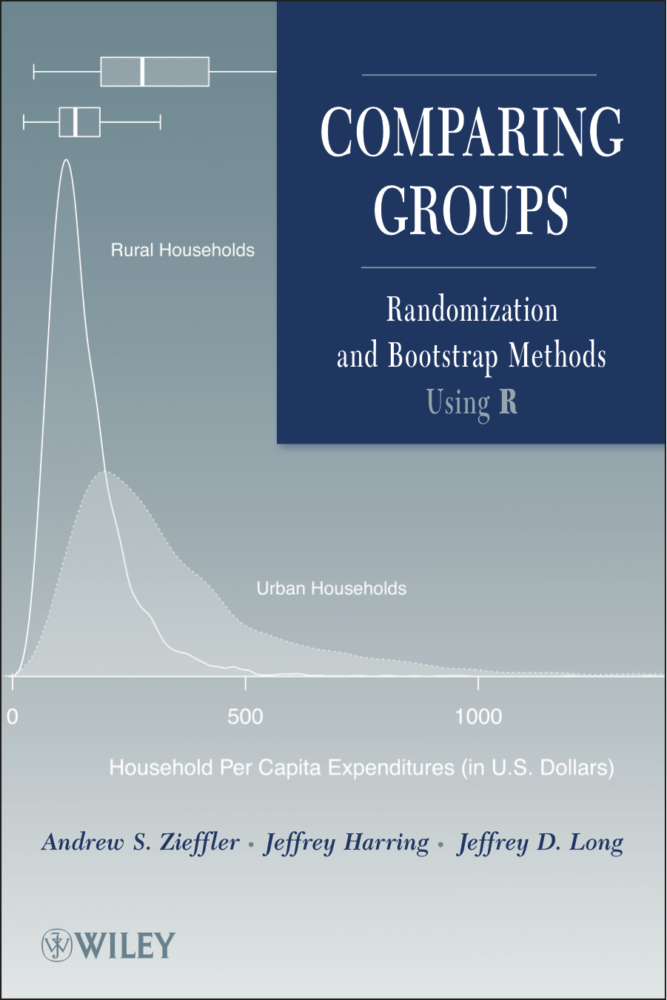

--- 
title: "Comparing Groups (Draft)"
author: "Andrew Zieffler, Jeffrey Harring, & Jeffrey Long"
date: "`r Sys.Date()`"
site: bookdown::bookdown_site
output: 
  bookdown::html_book:
    highlight: zenburn
    toc: TRUE
    toc_depth: 1
    number_sections: FALSE
    split_by: chapter
    split_bib: yes
    css: ['style/style.css', 'style/table-styles.css', 'style/syntax.css', 'style/navbar.css']
documentclass: book
bibliography: [book.bib, packages.bib, comparing-groups.bib]
csl: 'style/apa-single-spaced.csl'
link-citations: yes
github-repo: zief0002/comparing-groups-draft
description: "A draft of an updated version of Comparing Groups"
---


              
              

```{r book-setup, include=FALSE}
# Load libraries
library(knitr)
library(kableExtra)
library(patchwork)


opts_knit$set(
  width = 85, 
  tibble.print_max = Inf
  )


# Set knitr options
opts_chunk$set(
  prompt = FALSE, 
  comment = NA, 
  message = FALSE, 
  warning = FALSE, 
  tidy = FALSE, 
  fig.align = 'center',
  out.width = '50%'
  )


# Set global options
options(htmltools.dir.version = FALSE)
```


# Preface {-}




We published *Comparing Groups: Randomization and Bootstrap Methods Using R* in 2011, almost a decade ago. A lot has changed since then. R, and computing more generally, has become more prevalent in the social sciences. The functions we used and computation we introduced in 2011 were primarily those from Base R. Since that time, functionality from the Tidyverse set of packages has replaced Base R in most of my own work and teaching, and offer better alternatives for carrying out the analyses we presented in *Comparing Groups*.

Right around the time the book was sent for publication, a a beta version of an R IDE called RStudio was released. Not included in the first edition, RStudio is, in my opinion, the best way of interacting with R. It offers so many advantages to both the experienced programmer and the beginning student. It has transformed the way in which I work and needs to be included in any book that introduces and uses R.

Aditionally, the introduction of **knitr**, **bookdown**, and RMarkdown make it easier to update a book that, after we finished, I swore I would never update due to the amount of work involved. These tools, which allow us to embed and use the syntax directly in the text of the book will (hopefully) help to remove many of the computational and syntax errors and misprints that plagued the first edition of *Comparing Groups*. Amazing how many of those got through, even after copious numbers of reads and re-reads.

For these reasons, it is time to update *Comparing Groups*. As I draft this second edition, I will post things here. Feel free to offer criticism, suggestion, and feedback. You can either [open an issue](https://github.com/zief0002/comparing-groups-draft/issues) on the book's github page or [send me an email](mailto: zief0002@umn.edu) directly.

<br />

Andrew Zieffler

zief0002@umn.edu


<br /> <br />

# Foreword {-}

<!-- ## Table Test -->

<!-- ```{r echo=FALSE, message=FALSE, warning=FALSE} -->
<!-- # Load libraries -->
<!-- library(knitr) -->
<!-- library(kableExtra) -->
<!-- library(tidyverse) -->

<!-- data.frame( -->
<!--   Measure = c("Peer rating", "Acceptance rate for Ph.D. students", "Enrollment",  -->
<!--               "GRE score (verbal)", "GRE score (quantitative)"), -->
<!--   Mean = c(3.3, 40.1, 969.8, 154.9, 151.0), -->
<!--   SD = c(0.5, 20.2, 664.9, 3.7, 4.4) -->
<!-- ) %>% -->
<!--   kable( -->
<!--     format = "html", -->
<!--     escape = FALSE, -->
<!--     col.names = c("Measure", "*M*", "*SD*"), -->
<!--     align = c("l", "c", "c"), -->
<!--     caption = "<br/>Means and Standard Deviations for Five Measures of Graduate Programs of Education", -->
<!--     table.attr = "style='width:60%;'" -->
<!--     ) %>% -->
<!--   kable_styling() %>% -->
<!--   row_spec(row = 0, align = "c") -->
<!-- ``` -->

<!-- ## Figure Test -->

<!-- ```{r message=FALSE, echo=FALSE, fig.topcaption=TRUE, fig.cap='Histogram of the age distribution.', fig.width=5, fig.height=4} -->
<!-- # Import data -->
<!-- vlss = read_csv("https://raw.githubusercontent.com/zief0002/musings/master/data/vlss-age.csv") -->

<!-- ggplot(data = vlss, aes(x = Age)) + -->
<!--   geom_histogram(color = "black", fill = "skyblue") + -->
<!--   theme_bw() -->
<!-- ``` -->

<br /><br />

## Colophon

Artwork by [&commat;allison_horst](https://twitter.com/allison_horst)

The book is typeset using [Crimson Text](https://fonts.google.com/specimen/Crimson+Text) for the body font, [Raleway](https://fonts.google.com/specimen/Raleway) for the headings and [Sue Ellen Francisco](https://fonts.google.com/specimen/Sue+Ellen+Francisco) for the title. The color palette was generated using [coolors.co](https://coolors.co/).

<br /><br />


